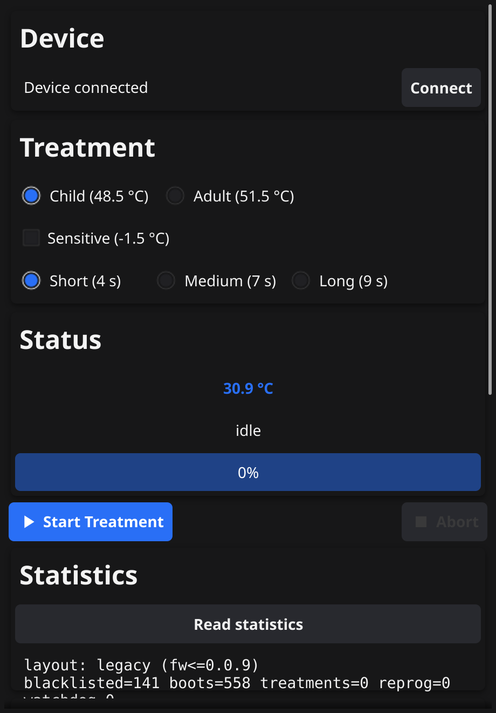

# heatstick — desktop app

A cross-platform desktop replica of the "heat it®" smartphone app
(Kamedi GmbH) for the **heat it dongle** (USB, VID/PID `32f9:0001`),
written in Go with [Fyne](https://fyne.io) (UI) and
[gousb](https://github.com/google/gousb) (USB transport).

Targets: **Linux (X11 + Wayland)**, **Windows** and **macOS**.

| | | |
|---|---|---|
|  |  |  |
| idle (light) | treating (40 % progress, active phase) | idle (dark mode) |

## Features

- **Auto-connect** — finds the dongle on startup and switches it to the
  application USB configuration; live temperature, phase
  (idle / warmup / active) and progress bar at 5 Hz.
- **Treatment settings** — Child (48.5 °C) / Adult (51.5 °C) base,
  *Sensitive* (−1.5 °C) modifier, duration Short (4 s) / Medium (7 s) /
  Long (9 s). Temperature/duration levels match the official app.
- **Start / Abort** — starts a treatment on the device and tracks it through
  the firmware phases until it finishes.
- **Statistics** — reads the 81-byte `INTERNAL_MEMORY` blob (9 pages),
  decodes it (boots, finished treatments, reprogrammings, watchdogs, error
  counters, per-treatment max temperatures) and shows the raw hex.
- **Version info** — reads the 12-byte version block from flash and shows
  the version tuples + raw hex.
- **LED** — arms the firmware phase LED on connect (green-flash standby →
  violet-blink warmup → blue-steady active), plus manual presets in the
  debug card (standby / off / green / red / blue / white).
- **Debug card** — raw 12-byte frame send with response + checksum check,
  live USB traffic log (hex frames with timestamps), version read.
- **Dark mode** toggle.

## Build & run

Prerequisites (Linux): Go ≥ 1.24, libusb, and the Fyne system libraries
(`libxkbcommon-dev`, `libegl-dev`, `libxxf86vm-dev`, `libusb-1.0-0-dev`).

```sh
go build ./...
go run ./cmd/heatstick/
# or build a binary:
go build -o heatstick-app ./cmd/heatstick/ && ./heatstick-app
```

Flags:

| Flag | Effect |
|---|---|
| `-dark` | start in dark mode (default: follow the system light/dark setting) |
| `-treat` | start a treatment automatically once connected |

App screenshots are rendered by the test driver (see
`cmd/heatstick/screenshot_test.go`) — the GL driver's `Canvas.Capture()`
returns noise on desktop, so this is the supported way to regenerate
`docs/screenshots/`:

```sh
go test ./cmd/heatstick/ -run TestScreenshots -v
```

### Windows cross-compile

```sh
CGO_ENABLED=1 GOOS=windows GOARCH=amd64 CC=x86_64-w64-mingw32-gcc \
    go build -o heatstick.exe ./cmd/heatstick/
```

(Requires the MinGW-w64 toolchain **and** a mingw libusb, e.g.
`apt-get install mingw-w64` + libusb built for the cross target. The
GitHub release pipeline avoids this entirely via [fyne-cross].)

## Releases (GitHub Actions)

Pushing a semver tag (`v1.2.3`) — or running the **Release** workflow
manually — builds all platform binaries with
[fyne-cross](https://github.com/fyne-io/fyne-cross) and publishes them as
a GitHub Release:

| asset | content |
|---|---|
| `heatstick_<ver>_linux-amd64` / `_linux-arm64` | Linux binary |
| `heatstick_<ver>_windows-amd64.exe` | Windows binary |
| `heatstick_<ver>_darwin-amd64` / `_darwin-arm64` | macOS binary |
| `SHA256SUMS.txt` | checksums |

CI (gofmt / vet / build / test) runs on every push to `main` and on PRs.

[fyne-cross]: https://github.com/fyne-io/fyne-cross

### USB access (Linux)

The dongle needs no root if a udev rule grants access, e.g.
`/etc/udev/rules.d/99-heatstick.rules`:

```
SUBSYSTEM=="usb", ATTR{idVendor}=="32f9", ATTR{idProduct}=="0001", MODE="0666"
```

## Project structure

```
├── cmd/heatstick/    the desktop app (Fyne UI + controller)
├── device/          USB transport (gousb) + protocol layer
├── research/        reverse-engineering artifacts (tools, logs, protocol spec)
└── docs/screenshots/  app screenshots (regenerated via go test)
```

The protocol specification and the LED state machine findings are
documented in [`research/protocol.md`](research/protocol.md) and
[`research/led.md`](research/led.md).

## About this project

This entire project — reverse engineering the USB protocol from the
official Android APK, implementing the device layer and the desktop app,
debugging it against the physical hardware, and writing these documents —
was done **autonomously by Qwen 3.8 27B**
(`qwen3.8:27b-coder-xhigh`, run locally via LiteLLM, driven as a CLI
coding agent). The human contribution was the physical dongle, the
official app (used as the decompilation reference), spot checks of
physical behavior (LED phases, treatment temperatures), and the initial
goal statement. **No lines of code were written by a human.**

Timeline: August 2026.
